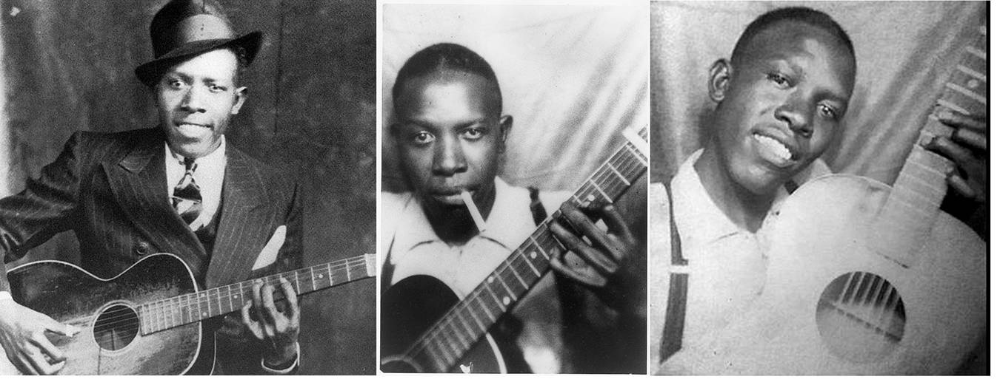
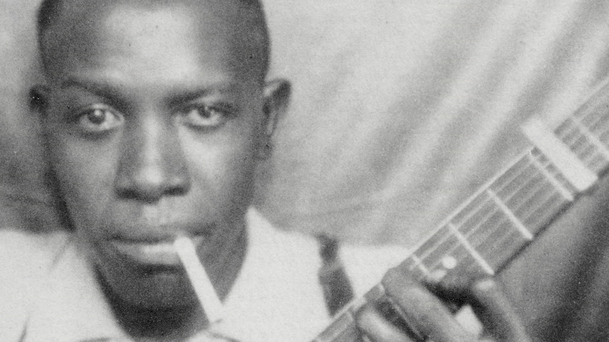

Just reposting an article I read on the internet about one of the blues musicians, Robert Johnson. There is a tragic story behind the musical journey of a Robert Johnson to be recognized as one of the legendary blues musician.

One night at a Mississippi juke joint in 1930, Son House and Willie Brown played their infamous Delta Blues tunes to a packed house. During the intermission, a young, bright-eyed, 19-year-old Robert Johnson conjured up the courage to take hold of the musician’s instruments and show the crowd what he got. To his surprise, the crowd was displeased with his performance. Even Son House admitted that his guitar playing was severely below par, and he was a better harmonica player if that. Following these events, Robert Johnson disappeared for approximately three years before making an appearance on a stage again, but this time he had mastered the Blues. This came as a surprise to those that knew him before his disappearance, but folks began to discredit his talents with stories and myths. The most famous story that many people recognize today is that he sold his soul to the Devil at the crossroads of Highways 49 and 61. To support these theories of Robert Johnson, the songs he did record complimented these tales quite well. A few of his titles included “Hellhound on My Trail,” “Cross Road Blues,” “Up Jumped the Devil,” and “Me and the Devil Blues.”

<!--truncate-->

Although Robert Johnson is credited with being the first musician to bargain with the Devil, it began with Tommy Johnson, a musician with no relation to Robert Johnson. A relative of Tommy’s recalls his stories as such,

*you go to where a road crosses that way, where a crossroads is. Get there, be sure to get there just a little ‘fore 12:00 that night so you’ll know you’ll be there. You have your guitar and be playing a piece there by yourself […] A big black man will walk up there and take your guitar, and he’ll tune it. And then he’ll play a piece and hand it back to you. That’s the way I learned to play anything I want.*

The only difference between Robert Johnson’s story and Tommy Johnson’s accounts was the age at which they died. After a career that lasted him just over five years, Robert Johnson died at the age of 27, whereas Tommy lived well into his sixties.

Johnson's stepsister Annye C. Anderson was twelve years old when he died, and she has fond memories of growing up in Memphis in an extended family that included the man she knew as "Brother Robert." "Brother Robert" is also the title of the book Anderson wrote with coauthor Preston Lauterbach, published in 2020 (Hachette Books.)

If you know anything about Robert Johnson, it's probably that he acquired his guitar expertise by making a deal with the devil at the crossroads. That's the myth that has persisted through the years, seemingly made more plausible by bluesman Son House's remarks about Johnson inexplicably going from a terrible to a remarkably skilled guitarist in a matter of months. 

According to Anderson, Robert Johnson was not a country boy. He didn't like farm work. He didn't launder or cook. "Brother Robert was tied up in his music." At one point she makes the very interesting comment that "nobody else was playing like Brother Robert." He knew the music played by jug bands, and he knew the blues, but "he wanted modern...He worked to distinguish himself."

In the end, Annye Anderson is proud of her Brother Robert. His innovative guitar style and songwriting provided the bridge between the Delta blues that formed him, and the electric blues and rock 'n' roll that he influenced. Anderson could see it as a child. "He wanted modern."

## References

- [A Deal With The Devil? The Robert Johnson You Don't Know](https://www.iowapublicradio.org/ipr-music/2021-07-14/a-deal-with-the-devil-the-robert-johnson-you-dont-know)
- [Stories of the Crossroads: Blues Myths ](https://nationalbluesmuseum.org/stories-of-the-crossroads-blues-myths-did-robert-johnson-really-sell-his-soul-to-the-devil/)