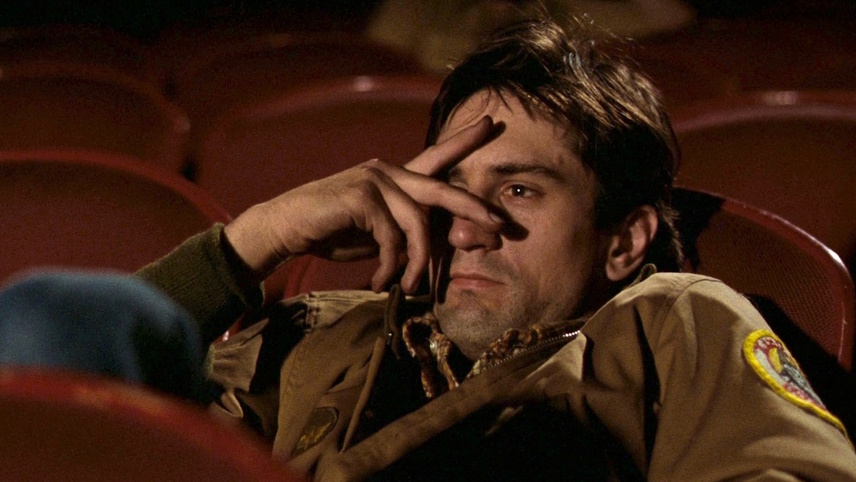

Travis as an outsider thinks outside the box, he becomes motivated to free himself from the shackles of a self-centred, uncaring society to do what he deems morally right. Travis assumes a sense of grandiose and intentionally radicalises himself to sooth the agonising sense of loneliness and rejection in his heart. To call him a nutcase is ignorant, judgemental and typical of the cold, distant society that Travis hates. Socially inept and detached as he may be, Travis is a good man.

