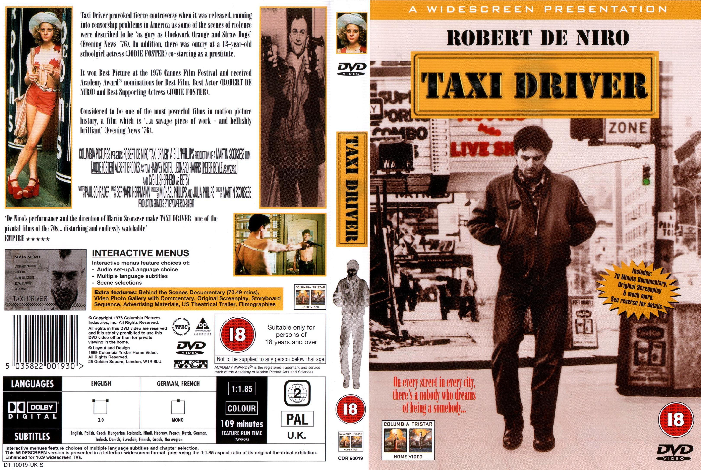
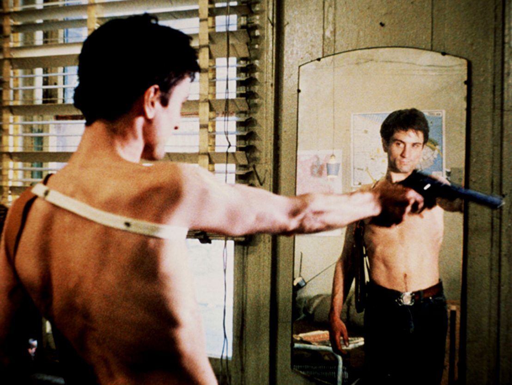

Less than a year after the end of the Vietnam War, Martin Scorsese’s Taxi Driver was released on February 8th, 1976. Written by Paul Schrader, the film is a psychological character study of Robert De Niro’s Travis Bickle, a Vietnam vet who takes a job as a night shift cabbie. His late hours expose him to what he considers the scum of the earth, and his progressively deteriorating mental state leads him to a complete break and disillusionment with reality. A personal project for Scorsese, De Niro and especially Schrader, none of the three believed that the film would prove successful; in fact, Scorsese has admitted that their motivation for making it was simply because they had to. Well, of course, Taxi Driver wound up being one of the best films of the year; it was nominated for four Academy Awards, including Best Picture, and won the Palme d’Or in Cannes three months after its American premiere.

<!--truncate-->

Travis Bickle is at his most basic level a character desperate to find some kind of purpose in life. He has a meaningless, repetitive job, a distanced relationship with his family, is romantically unattached, a friendless loner whose only worth to society, as a soldier in Vietnam (which resulted in a pretty serious case of PTSD), has now been completely forgotten. These characteristics (being stuck in a meaningless rut, loneliness, mental health issues, etc) are things that most people go through at some point in their lives- one level on which we can empathise with Travis. There is no shame in experiencing these feelings per se, of course, and particularly in this day and age with therapy and self-help being largely de-stigmatised most people can find healthy, productive ways to work through these issues. Travis is not so lucky; as a product of his time, place, mentality and socio-economic status he is left to fend completely for himself, to create his own, far less healthy coping mechanisms. While most of us watching the movie today can objectively see these for how childish, pathetic and troubling these are, there is at the same time a small part of Travis’ ethos (as outlined in his narration) that can speak to us on a very primal, Jungian level.

The story of the film is told dynamically, and the intrigue grows increasingly, without plot jumps and twists. Travis, the main character, is introduced as a taxi driver with an eccentric character and ambiguous thinking, which allows interpreting the events of the movie ambivalently. For instance, the fact that Travis keeps a diary emphasizes his loneliness, although he is constantly among people and can communicate much (Taxi Driver). Scorsese introduces the public to Travis as a teenager, despite his age. The main character’s inclinations towards radicalism, denial and opposition to society help form a clear view of him as a person who is not mature enough to make sound reasoning. No special visual and sound effects are used to convey an alarm. Nevertheless, due to intense dialogues, it seems that the taxi driver is on the verge of a nervous breakdown. His communication with himself in the mirror reveals a depth of his loneliness and mental imbalance (Taxi Driver). The detachment and coldness of New Yorkers are one of the main topics that make it possible to concentrate on the image of Travis and his experiences.

This is what makes Travis Bickle such an interesting and complex character. While nobody but the most obtuse viewer is actually cheering for him by the end and he is clearly presented as a pathetic and deeply flawed character, there are elements of his philosophy that speak to the darker side within all of us, to the side that wants to scream out against the injustices within our flawed society just as much as we understand deep down how wrong this sort of directionless, petty vigilante justice (that in Bickle’s case is never about actual justice but more about fuelling his own fantasy and self-image) would be. At the same time, the way he is ultimately lauded as a hero for his actions speaks to how shallow and manipulable society is as a whole, and how ultimately we are all complicit in creating men like Bickle even if we condemn their actions. This is of course part of the reason why the movie was criticised in some circles at the time by those who felt that on the surface it seemed to glorify the actions of men like Bickle and that art has a social responsibility to preserve moral order.

## References

- [Taxi Driver: Inside the Mind of Travis Bickle](https://tilt.goombastomp.com/film/taxi-driver-and-inside-the-mind-of-travis-bickle/)
- [“Taxi Driver” Film by Martin Scorsese Essay ](https://ivypanda.com/essays/taxi-driver-film-by-martin-scorsese/)
- [Taxi Driver Ending Explained: What’s Real & What’s In Travis’ Head?](https://wechoiceblogger.com/taxi-driver-ending-explained-whats-real-whats-in-travis-head/)